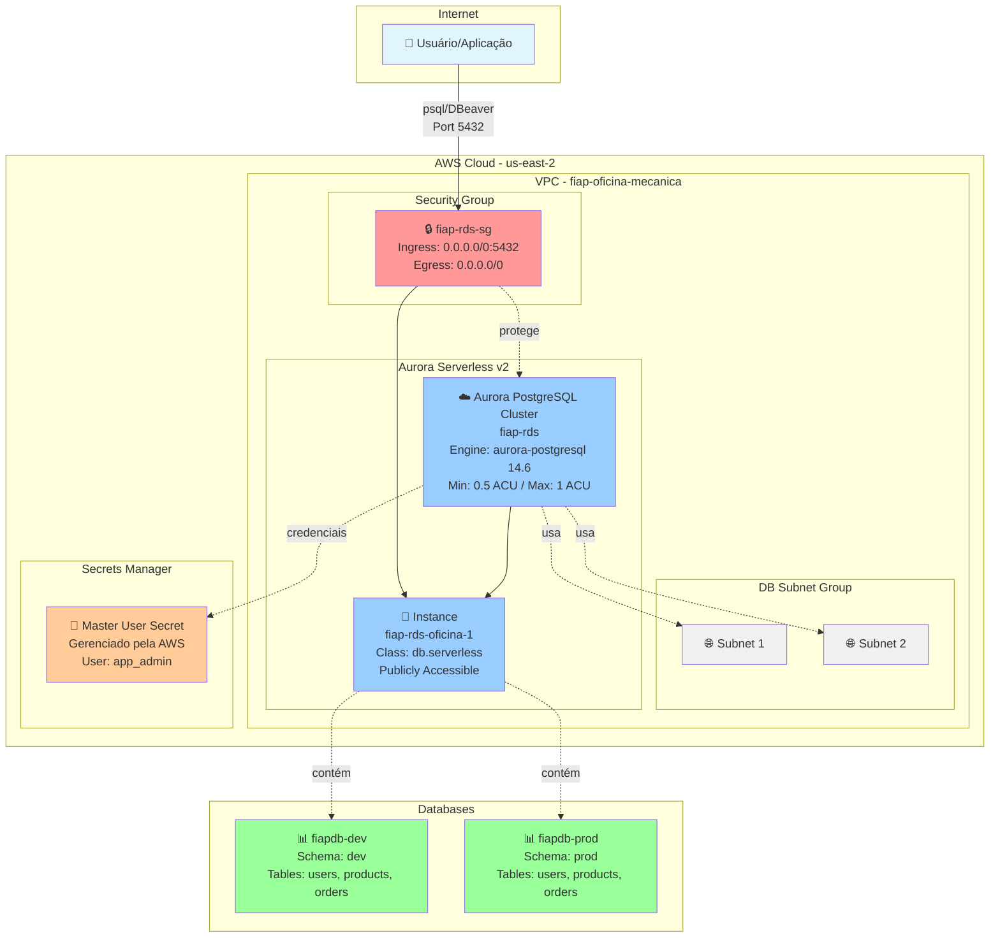
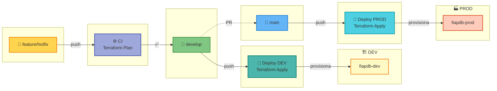

# Infraestrutura de Banco de Dados

Este repositório contém a infraestrutura como código (Terraform) para provisionar e gerenciar o banco de dados Aurora PostgreSQL Serverless v2 na AWS.



## 📁 Estrutura do Projeto

```
.
├── /                    # Raiz - Provisiona o cluster RDS Aurora
│   ├── backend.tf
│   ├── data.tf
│   ├── outputs.tf
│   ├── providers.tf
│   ├── rds.tf
│   └── variables.tf
│
└── sql/                 # Databases e tabelas
    ├── backend.tf
    ├── data.tf
    ├── database.tf      # Cria fiapdb-dev e fiapdb-prod
    ├── outputs.tf
    ├── providers.tf
    ├── tables.tf        # Exemplos de tabelas
    └── variables.tf
```

## 🚀 Fluxo de Deploy

### 1. Criar o Cluster Aurora (Raiz)

```bash
# Na raiz do projeto
terraform init
terraform plan
terraform apply
```

Isso cria:
- Aurora PostgreSQL Serverless v2
- Security Group
- Subnet Group
- Credenciais gerenciadas pela AWS (Secrets Manager)

### 2. Criar Databases e Tabelas (pasta sql/)

```bash
# Depois que o cluster estiver pronto
cd sql
terraform init
terraform plan
terraform apply
```

Isso cria:
- Database `fiapdb-dev`
- Database `fiapdb-prod`
- Schemas e tabelas de exemplo (users, products, orders)

## 🔄 CI/CD

### Workflows Separados

**CI (Pull Requests e branches)**
- Valida e planeja infraestrutura do cluster
- Valida e planeja databases/tabelas
- Executa em sequência: primeiro cluster, depois sql

**CD (Branch main)**
- Deploy do cluster Aurora
- Deploy dos databases e tabelas
- Execução automática em sequência

### Pipeline



## 🔐 Acesso ao Banco

### Recuperar Credenciais

```bash
# ARN do secret
terraform output rds_master_user_secret_arn

# Buscar senha no Secrets Manager
aws secretsmanager get-secret-value \
  --secret-id <ARN> \
  --query SecretString \
  --output text | jq -r .password
```

### Endpoints

```bash
# Writer endpoint
terraform output rds_endpoint

# Reader endpoint  
terraform output rds_reader_endpoint
```