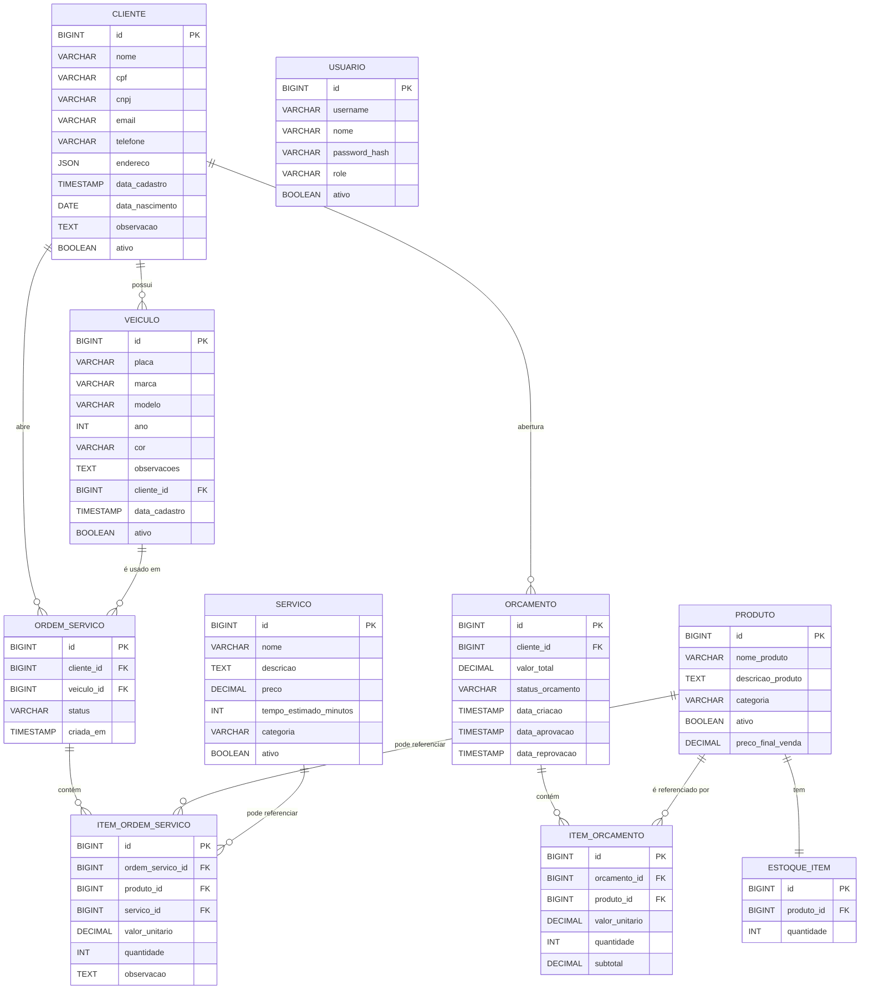

# Criação do banco de dados (PostgreSQL)

Este repositório provisiona os recursos necessários para rodar um PostgreSQL no cluster EKS da AWS, incluindo um StorageClass (EBS) e os manifests Kubernetes para deploy do banco.

Conteúdo principal:

- Terraform para provisionamento de recursos relacionados ao banco (backend, storage, database).
- Manifests Kubernetes em `k8s/` para criar Secrets, ConfigMaps, Service, StatefulSet e Job de bootstrap.

## Visão geral

O banco escolhido é o PostgreSQL. A infraestrutura usa Terraform para criar recursos na AWS (quando aplicável) e os manifests em `k8s/` para subir o banco no EKS.

> Observação: este repositório pressupõe que o cluster EKS já esteja criado. A configuração do cluster está em: [infra-kubernetes](https://github.com/fiap-soat-grupo36/infra-kubernetes)

### Diagrama



## 🗂️ Estrutura do repositório

```text
infra-database
 ┣ .github/
 ┣ k8s/
 ┃ ┣ 01-secret.yaml
 ┃ ┣ 01b-bootstrap-secret.yaml
 ┃ ┣ 02-configmap.yaml
 ┃ ┣ 03-service-headless.yaml
 ┃ ┣ 04-service.yaml
 ┃ ┣ 06-statefulset.yaml
 ┃ ┣ 07-bootstrap-sql-configmap.yaml
 ┃ ┗ 08-bootstrap-job.yaml
 ┣ .gitignore
 ┣ README.md
 ┣ backend.tf
 ┣ data.tf
 ┣ database.tf
 ┣ providers.tf
 ┗ storageclass.tf
```

## ⚡ Pré-requisitos

- 🟢 Terraform instalado
- 🟢 AWS CLI configurado com usuário da sua conta AWS
- 🟢 Bucket S3 criado para armazenar o `tfstate`
- 🟢 Atualize o nome do bucket S3 em [`backend.tf`](../infra/backend.tf)

## Configuração do backend do Terraform

Edite `backend.tf` para apontar ao bucket S3 correto onde será armazenado o `tfstate`. Exemplo de como passar o bucket na inicialização (opção alternativa):

```sh
terraform init \
  -backend-config="bucket=seu-bucket-terraform" \
  -backend-config="key=infra-database/terraform.tfstate" \
  -backend-config="region=us-east-1"
```

Observação: o arquivo `backend.tf` no repositório contém a configuração padrão para o projeto — verifique e ajuste o `bucket`, `key` e `region` conforme sua conta.

## 🚀 Como aplicar (passo a passo)

1. Configure credenciais AWS (exemplo):

```sh
aws configure
```

1. Inicialize o Terraform (com backend configurado):

```sh
terraform init
```

1. Review do plano:

```sh
terraform plan
```

1. Aplique:

```sh
terraform apply
```

## 🛡️ Como acessar a Bastion EC2 via SSH

1. Tenha a chave privada (bastion-key) gerada e salva em sua máquina. Criada no passo anterior de configuração do cluster([infra-kubernetes](https://github.com/fiap-soat-grupo36/infra-kubernetes))
2. Obtenha o IP público da instância Bastion.
    - No console AWS EC2, procure pela instância e copie o IP público.

3. Acesse via terminal:

```sh
    ssh -i .ssh/bastion-key ec2-user@<ip-publico-da-bastion>
```

4. Se for a primeira vez, aceite a chave do host digitando yes quando solicitado.

5. Para usar os comando `kubectl` execute como usuário root

```sh
    sudo su
```

6. Pode ser necessário configurar o .kubeconfig ao acessar a bastion:

```sh
    aws eks update-kubeconfig --name eks-fiap-oficina-mecanica --region us-east-1 --alias bastion-cluster
```

### Acessar o PostgreSql pela Bastion

1. Abre a conexão com o pod:

```sh
kubectl -n oficina exec -it postgresql-0 -- /bin/bash
```

2. Faça login no database:

```sh
psql -U postgres -d oficina -h localhost -p 5432
```

Agora você já consegue executar comandos SQL.
