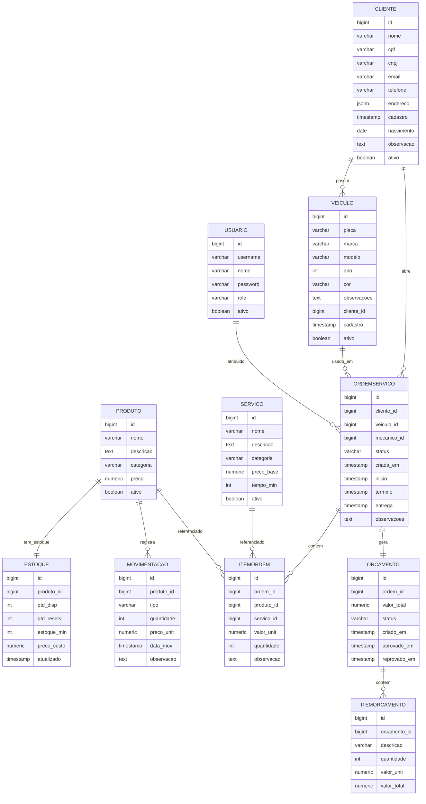
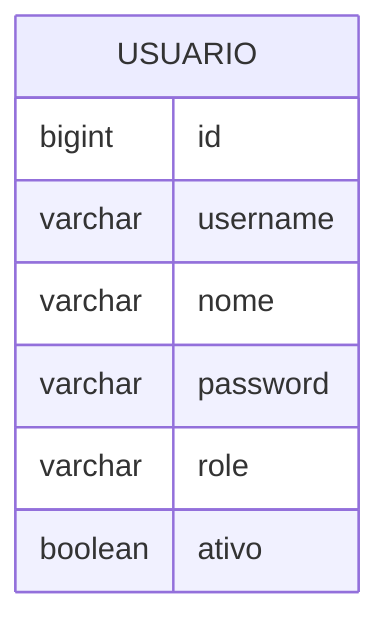
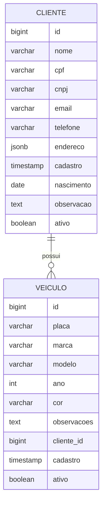
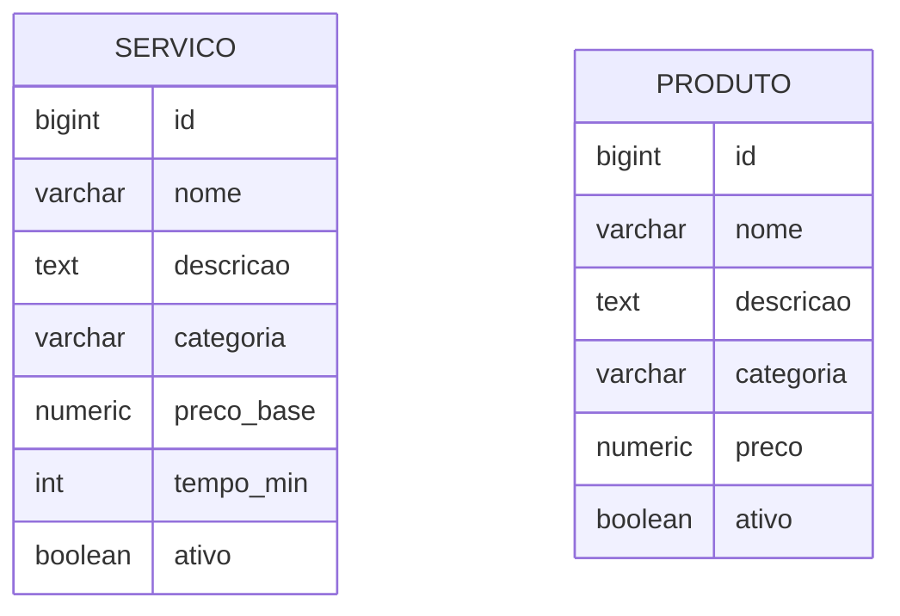
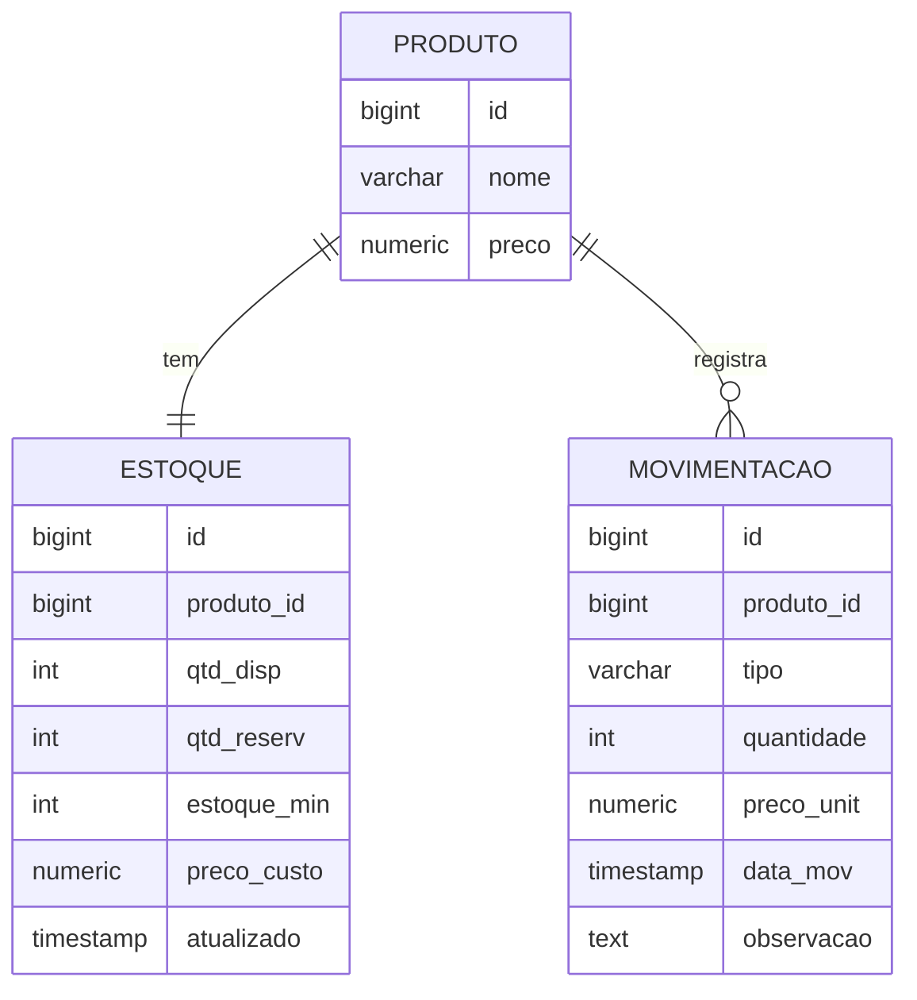
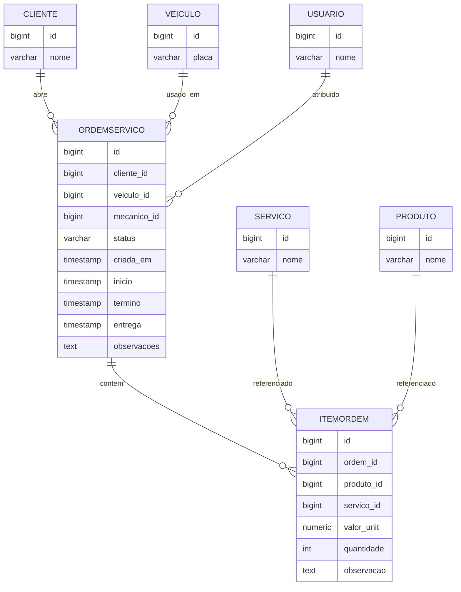
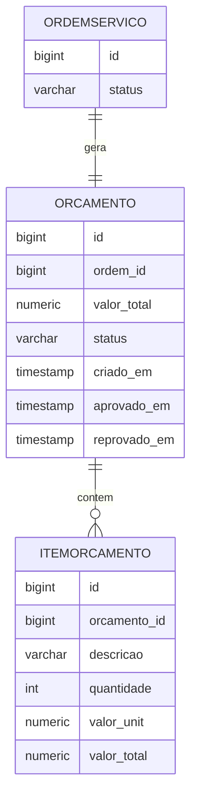
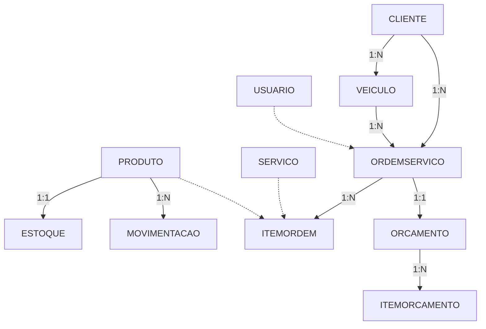

# Diagramas ER - Sistema de Oficina Mecânica

## 📋 Índice

- [Diagrama Completo](#diagrama-completo)
- [Diagrama por Microserviço](#diagrama-por-microserviço)
- [Diagrama Simplificado](#diagrama-simplificado)
- [Legenda e Convenções](#legenda-e-convenções)

> **Nota:** Os nomes das tabelas nos diagramas foram simplificados para compatibilidade com o renderizador Mermaid do GitHub. Veja a [tabela de mapeamento](#mapeamento-de-nomes) para os nomes reais no banco de dados.

---

## 🗂️ Diagrama Completo

Este diagrama mostra **todas as 11 tabelas** com seus atributos principais e relacionamentos.



---

## 🔤 Mapeamento de Nomes

### Tabelas

| Diagrama | Banco de Dados | Microserviço |
|----------|---------------|--------------|
| `USUARIO` | `usuarios` | auth-service |
| `CLIENTE` | `clientes` | customer-service |
| `VEICULO` | `veiculos` | customer-service |
| `SERVICO` | `servicos` | catalog-service |
| `PRODUTO` | `produtos_catalogo` | catalog-service |
| `ESTOQUE` | `produtos_estoque` | inventory-service |
| `MOVIMENTACAO` | `movimentacoes_estoque` | inventory-service |
| `ORDEMSERVICO` | `ordens_servico` | work-order-service |
| `ITEMORDEM` | `itens_ordem_servico` | work-order-service |
| `ORCAMENTO` | `orcamentos` | budget-service |
| `ITEMORCAMENTO` | `itens_orcamento` | budget-service |

### Colunas Abreviadas

| Diagrama | Banco de Dados |
|----------|---------------|
| `qtd_disp` | `quantidade_disponivel` |
| `qtd_reserv` | `quantidade_reservada` |
| `estoque_min` | `estoque_minimo` |
| `preco_unit` | `preco_unitario` |
| `data_mov` | `data_movimentacao` |
| `valor_unit` | `valor_unitario` |
| `tempo_min` | `tempo_estimado_minutos` |

---

## 🏢 Diagrama por Microserviço

### Auth Service



**Tabela real:** `usuarios`

**Roles:** ADMIN, CLIENTE, MECANICO, ATENDENTE, ESTOQUISTA

---

### Customer Service



**Tabelas reais:** `clientes`, `veiculos`

**Constraints:**
- Cliente: CPF OU CNPJ (exclusivo)
- Placa: Mercosul ou formato antigo
- Ano: 1900 até atual+1

---

### Catalog Service



**Tabelas reais:** `servicos`, `produtos_catalogo`

**Categorias Serviço:** MECANICO, ELETRICO, FREIOS, ALINHAMENTO, SUSPENSAO

**Categorias Produto:** PECA, INSUMO

---

### Inventory Service



**Tabelas reais:** `produtos_catalogo`, `produtos_estoque`, `movimentacoes_estoque`

**Tipos:** ENTRADA, SAIDA

---

### Work Order Service



**Tabelas reais:** `ordens_servico`, `itens_ordem_servico`

**Status:** RECEBIDA, EM_DIAGNOSTICO, AGUARDANDO_APROVACAO, EM_EXECUCAO, FINALIZADA, ENTREGUE, REPROVADA, CANCELADA

---

### Budget Service



**Tabelas reais:** `orcamentos`, `itens_orcamento`

**Status:** CRIADO, APROVADO, REPROVADO

---

## 🎨 Diagrama Simplificado



---

## 📖 Legenda

### Cardinalidades

- `||--o{` = Um para muitos
- `||--||` = Um para um
- `o|--o{` = Zero ou um para muitos

### ON DELETE

| Ação | Quando Usar |
|------|-------------|
| **RESTRICT** | Impede deleção (clientes, produtos) |
| **CASCADE** | Deleta em cascata (itens, detalhes) |
| **SET NULL** | Define NULL (mecânico opcional) |

---

## 📊 Foreign Keys

| Tabela | FK | Destino | ON DELETE |
|--------|-----|---------|-----------|
| veiculos | cliente_id | clientes | RESTRICT |
| ordens_servico | cliente_id | clientes | RESTRICT |
| ordens_servico | veiculo_id | veiculos | RESTRICT |
| ordens_servico | mecanico_id | usuarios | SET NULL |
| itens_ordem_servico | ordem_servico_id | ordens_servico | CASCADE |
| produtos_estoque | produto_catalogo_id | produtos_catalogo | CASCADE |
| movimentacoes_estoque | produto_catalogo_id | produtos_catalogo | RESTRICT |
| orcamentos | ordem_servico_id | ordens_servico | CASCADE |
| itens_orcamento | orcamento_id | orcamentos | CASCADE |

---

## 📊 Estatísticas

- **Tabelas:** 11
- **Foreign Keys:** 11
- **Unique Constraints:** 8
- **Check Constraints:** 15
- **Índices:** 25+
- **Relacionamentos 1:1:** 2
- **Relacionamentos 1:N:** 9

---

## 🔍 Queries de Exemplo

### Listar OS de um cliente

```sql
SELECT 
    os.id,
    os.status,
    c.nome AS cliente,
    v.placa,
    u.nome AS mecanico
FROM ordens_servico os
JOIN clientes c ON c.id = os.cliente_id
JOIN veiculos v ON v.id = os.veiculo_id
LEFT JOIN usuarios u ON u.id = os.mecanico_id
WHERE c.id = 1
ORDER BY os.criada_em DESC;
```

### Estoque baixo

```sql
SELECT 
    pc.nome,
    pe.quantidade_disponivel,
    pe.estoque_minimo
FROM produtos_estoque pe
JOIN produtos_catalogo pc ON pc.id = pe.produto_catalogo_id
WHERE pe.quantidade_disponivel < pe.estoque_minimo;
```

### Total de OS

```sql
SELECT 
    os.id,
    SUM(ios.valor_unitario * ios.quantidade) AS total
FROM ordens_servico os
JOIN itens_ordem_servico ios ON ios.ordem_servico_id = os.id
WHERE os.id = 1
GROUP BY os.id;
```

---

## 📚 Referências

- [Mermaid ER Syntax](https://mermaid.js.org/syntax/entityRelationshipDiagram.html)
- [PostgreSQL Constraints](https://www.postgresql.org/docs/current/ddl-constraints.html)
- [GitHub Mermaid](https://docs.github.com/en/get-started/writing-on-github/working-with-advanced-formatting/creating-diagrams)

---

## 📝 Histórico

| Versão | Data | Descrição |
|--------|------|-----------|
| 1.0.0 | 2024-12-30 | Versão inicial |
| 1.1.0 | 2024-12-30 | Correção formatação GitHub |

---

**Repositório:** [infra-database](https://github.com/seu-usuario/infra-database)  
**Status:** ✅ Aprovado
