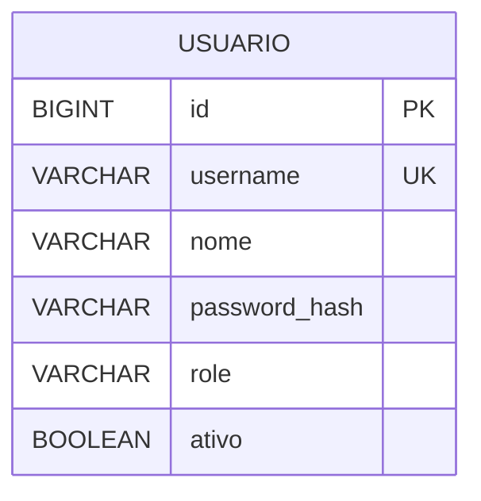
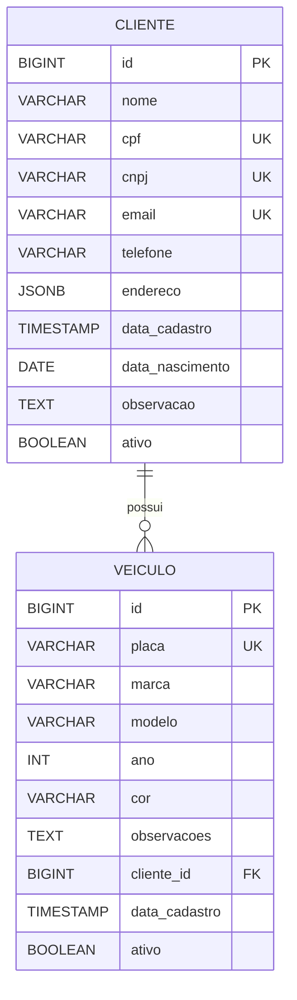
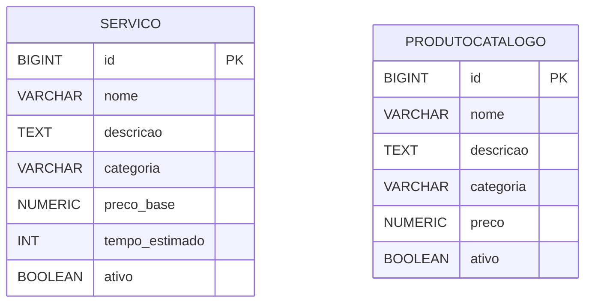
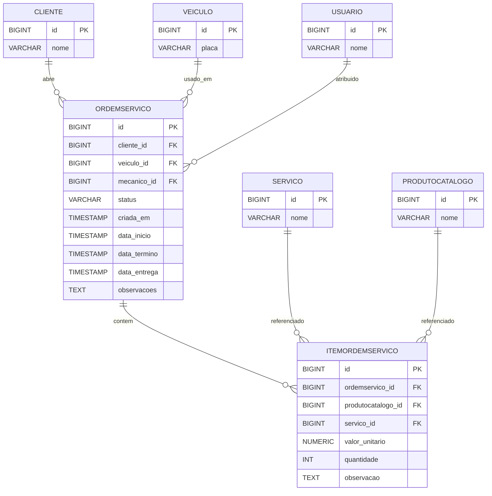
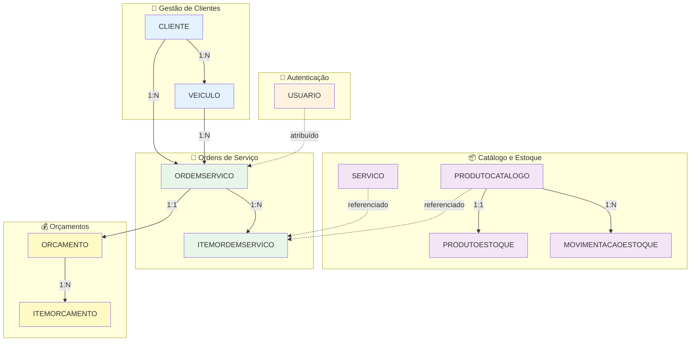

# Diagramas ER - Sistema de Oficina Mecânica

## 📋 Índice

- [Diagrama Completo](#diagrama-completo)
- [Diagrama por Microserviço](#diagrama-por-microserviço)
- [Diagrama Simplificado](#diagrama-simplificado)
- [Legenda e Convenções](#legenda-e-convenções)

> **Nota:** Os nomes das tabelas nos diagramas foram simplificados (sem underscores) para compatibilidade com o renderizador Mermaid do GitHub. Os nomes reais no banco de dados mantêm os underscores (ex: `ordem_servico`, `produto_catalogo`).

---

## 🗂️ Diagrama Completo

Este diagrama mostra **todas as 11 tabelas** com seus atributos principais e relacionamentos.

```mermaid
erDiagram
    USUARIO {
        BIGINT id PK
        VARCHAR username UK
        VARCHAR nome
        VARCHAR password_hash
        VARCHAR role
        BOOLEAN ativo
    }

    CLIENTE {
        BIGINT id PK
        VARCHAR nome
        VARCHAR cpf UK
        VARCHAR cnpj UK
        VARCHAR email UK
        VARCHAR telefone
        JSONB endereco
        TIMESTAMP data_cadastro
        DATE data_nascimento
        TEXT observacao
        BOOLEAN ativo
    }

    VEICULO {
        BIGINT id PK
        VARCHAR placa UK
        VARCHAR marca
        VARCHAR modelo
        INT ano
        VARCHAR cor
        TEXT observacoes
        BIGINT cliente_id FK
        TIMESTAMP data_cadastro
        BOOLEAN ativo
    }

    SERVICO {
        BIGINT id PK
        VARCHAR nome
        TEXT descricao
        VARCHAR categoria
        NUMERIC preco_base
        INT tempo_estimado_minutos
        BOOLEAN ativo
    }

    PRODUTOCATALOGO {
        BIGINT id PK
        VARCHAR nome
        TEXT descricao
        VARCHAR categoria
        NUMERIC preco
        BOOLEAN ativo
    }

    PRODUTOESTOQUE {
        BIGINT id PK
        BIGINT produtocatalogo_id FK_UK
        INT qtd_disponivel
        INT qtd_reservada
        INT estoque_minimo
        NUMERIC preco_custo_medio
        TIMESTAMP ultima_atualizacao
    }

    MOVIMENTACAOESTOQUE {
        BIGINT id PK
        BIGINT produtocatalogo_id FK
        VARCHAR tipo
        INT quantidade
        NUMERIC preco_unitario
        TIMESTAMP data_movimentacao
        TEXT observacao
    }

    ORDEMSERVICO {
        BIGINT id PK
        BIGINT cliente_id FK
        BIGINT veiculo_id FK
        BIGINT mecanico_id FK
        VARCHAR status
        TIMESTAMP criada_em
        TIMESTAMP data_inicio
        TIMESTAMP data_termino
        TIMESTAMP data_entrega
        TEXT observacoes
    }

    ITEMORDEMSERVICO {
        BIGINT id PK
        BIGINT ordemservico_id FK
        BIGINT produtocatalogo_id FK
        BIGINT servico_id FK
        NUMERIC valor_unitario
        INT quantidade
        TEXT observacao
    }

    ORCAMENTO {
        BIGINT id PK
        BIGINT ordemservico_id FK_UK
        NUMERIC valor_total
        VARCHAR status
        TIMESTAMP data_criacao
        TIMESTAMP data_aprovacao
        TIMESTAMP data_reprovacao
    }

    ITEMORCAMENTO {
        BIGINT id PK
        BIGINT orcamento_id FK
        VARCHAR descricao
        INT quantidade
        NUMERIC valor_unitario
        NUMERIC valor_total
    }

    CLIENTE ||--o{ VEICULO : possui
    CLIENTE ||--o{ ORDEMSERVICO : abre
    VEICULO ||--o{ ORDEMSERVICO : usado_em
    USUARIO ||--o{ ORDEMSERVICO : atribuido
    ORDEMSERVICO ||--o{ ITEMORDEMSERVICO : contem
    ORDEMSERVICO ||--|| ORCAMENTO : gera
    ORCAMENTO ||--o{ ITEMORCAMENTO : contem
    SERVICO ||--o{ ITEMORDEMSERVICO : referenciado
    PRODUTOCATALOGO ||--|| PRODUTOESTOQUE : tem_estoque
    PRODUTOCATALOGO ||--o{ ITEMORDEMSERVICO : referenciado
    PRODUTOCATALOGO ||--o{ MOVIMENTACAOESTOQUE : registra
```

**Mapeamento de Nomes:**
- Diagrama: `PRODUTOCATALOGO` → Banco: `produtos_catalogo`
- Diagrama: `PRODUTOESTOQUE` → Banco: `produtos_estoque`
- Diagrama: `MOVIMENTACAOESTOQUE` → Banco: `movimentacoes_estoque`
- Diagrama: `ORDEMSERVICO` → Banco: `ordens_servico`
- Diagrama: `ITEMORDEMSERVICO` → Banco: `itens_ordem_servico`
- Diagrama: `ITEMORCAMENTO` → Banco: `itens_orcamento`

---

## 🏢 Diagrama por Microserviço

### Auth Service



**Tabela real no banco:** `usuarios`

**Responsabilidade:** Autenticação e autorização de usuários do sistema.

**Roles disponíveis:**
- ADMIN
- CLIENTE
- MECANICO
- ATENDENTE
- ESTOQUISTA

---

### Customer Service



**Tabelas reais no banco:** `clientes`, `veiculos`

**Responsabilidade:** Gestão de clientes (PF/PJ) e seus veículos.

**Constraints importantes:**
- Cliente deve ter CPF **OU** CNPJ (não ambos)
- Placa deve ser formato Mercosul (ABC1D23) ou antigo (ABC1234)
- Ano do veículo entre 1900 e ano atual + 1

---

### Catalog Service



**Tabelas reais no banco:** `servicos`, `produtos_catalogo`

**Responsabilidade:** Catálogo de serviços e produtos oferecidos pela oficina.

**Categorias de Serviço:**
- MECANICO
- ELETRICO
- FREIOS
- ALINHAMENTO
- SUSPENSAO

**Categorias de Produto:**
- PECA
- INSUMO

---

### Inventory Service

```mermaid
erDiagram
    PRODUTOCATALOGO {
        BIGINT id PK
        VARCHAR nome
        NUMERIC preco
    }

    PRODUTOESTOQUE {
        BIGINT id PK
        BIGINT produtocatalogo_id FK_UK
        INT qtd_disponivel
        INT qtd_reservada
        INT estoque_minimo
        NUMERIC preco_custo_medio
        TIMESTAMP ultima_atualizacao
    }

    MOVIMENTACAOESTOQUE {
        BIGINT id PK
        BIGINT produtocatalogo_id FK
        VARCHAR tipo
        INT quantidade
        NUMERIC preco_unitario
        TIMESTAMP data_movimentacao
        TEXT observacao
    }

    PRODUTOCATALOGO ||--|| PRODUTOESTOQUE : tem
    PRODUTOCATALOGO ||--o{ MOVIMENTACAOESTOQUE : registra
```

**Tabelas reais no banco:** `produtos_catalogo`, `produtos_estoque`, `movimentacoes_estoque`

**Responsabilidade:** Controle de estoque e histórico de movimentações.

**Relacionamento 1:1:** Cada produto do catálogo tem **exatamente um** registro de estoque.

**Tipos de Movimentação:**
- ENTRADA
- SAIDA

---

### Work Order Service



**Tabelas reais no banco:** `ordens_servico`, `itens_ordem_servico`

**Responsabilidade:** Gestão de ordens de serviço e seus itens.

**Status da OS:**
- RECEBIDA
- EM_DIAGNOSTICO
- AGUARDANDO_APROVACAO
- EM_EXECUCAO
- FINALIZADA
- ENTREGUE
- REPROVADA
- CANCELADA

**Constraint importante:** Cada item da OS é **OU** produto **OU** serviço (não ambos).

---

### Budget Service

```mermaid
erDiagram
    ORDEMSERVICO {
        BIGINT id PK
        VARCHAR status
    }

    ORCAMENTO {
        BIGINT id PK
        BIGINT ordemservico_id FK_UK
        NUMERIC valor_total
        VARCHAR status
        TIMESTAMP data_criacao
        TIMESTAMP data_aprovacao
        TIMESTAMP data_reprovacao
    }

    ITEMORCAMENTO {
        BIGINT id PK
        BIGINT orcamento_id FK
        VARCHAR descricao
        INT quantidade
        NUMERIC valor_unitario
        NUMERIC valor_total
    }

    ORDEMSERVICO ||--|| ORCAMENTO : gera
    ORCAMENTO ||--o{ ITEMORCAMENTO : contem
```

**Tabelas reais no banco:** `orcamentos`, `itens_orcamento`

**Responsabilidade:** Gestão de orçamentos e aprovações.

**Relacionamento 1:1:** Cada OS tem **exatamente um** orçamento.

**Status do Orçamento:**
- CRIADO
- APROVADO
- REPROVADO

**Computed Column:** `valor_total` é calculado automaticamente (quantidade × valor_unitário).

---

## 🎨 Diagrama Simplificado (Alto Nível)

Visão geral sem detalhes de atributos:



---

## 📖 Legenda e Convenções

### Símbolos do Diagrama ER

| Símbolo | Significado |
|---------|-------------|
| **PK** | Primary Key (Chave Primária) |
| **FK** | Foreign Key (Chave Estrangeira) |
| **UK** | Unique Key (Chave Única) |
| **FK_UK** | Foreign Key que também é Unique (relação 1:1) |

### Cardinalidades

| Notação | Significado | Exemplo |
|---------|-------------|---------|
| `\|\|--o{` | Um para muitos (obrigatório no lado 1) | Cliente → Veículos |
| `\|\|--\|\|` | Um para um (obrigatório em ambos) | Produto → Estoque |
| `o\|--o{` | Zero ou um para muitos | Mecânico → OS |

### ON DELETE Actions

| Ação | Comportamento | Quando Usar |
|------|--------------|-------------|
| **RESTRICT** | Impede deleção se existirem registros relacionados | Entidades críticas (clientes, produtos) |
| **CASCADE** | Deleta automaticamente registros relacionados | Entidades dependentes (itens, detalhes) |
| **SET NULL** | Define FK como NULL | Relacionamentos opcionais (mecânico) |

### Cores por Contexto

| Cor | Contexto | Microserviço |
|-----|----------|-------------|
| 🔵 **Azul** | Clientes e Veículos | customer-service |
| 🟠 **Laranja** | Autenticação | auth-service |
| 🟣 **Roxo** | Catálogo e Estoque | catalog-service, inventory-service |
| 🟢 **Verde** | Ordens de Serviço | work-order-service |
| 🟡 **Amarelo** | Orçamentos | budget-service |

---

## 📊 Tabela de Foreign Keys

| Tabela Origem | Coluna FK | Tabela Destino | ON DELETE | Justificativa |
|---------------|-----------|----------------|-----------|---------------|
| **veiculos** | cliente_id | clientes | RESTRICT | Não pode deletar cliente com veículos |
| **ordens_servico** | cliente_id | clientes | RESTRICT | Não pode deletar cliente com OS |
| **ordens_servico** | veiculo_id | veiculos | RESTRICT | Não pode deletar veículo com OS |
| **ordens_servico** | mecanico_id | usuarios | SET NULL | Se mecânico sai, OS continua |
| **itens_ordem_servico** | ordem_servico_id | ordens_servico | CASCADE | Se OS deletada, itens também |
| **itens_ordem_servico** | produto_catalogo_id | produtos_catalogo | RESTRICT | Não pode deletar produto em uso |
| **itens_ordem_servico** | servico_id | servicos | RESTRICT | Não pode deletar serviço em uso |
| **produtos_estoque** | produto_catalogo_id | produtos_catalogo | CASCADE | Estoque segue o produto |
| **movimentacoes_estoque** | produto_catalogo_id | produtos_catalogo | RESTRICT | Histórico não pode ser perdido |
| **orcamentos** | ordem_servico_id | ordens_servico | CASCADE | Orçamento é parte da OS |
| **itens_orcamento** | orcamento_id | orcamentos | CASCADE | Itens seguem o orçamento |

---

## 📊 Estatísticas do Modelo

| Métrica | Quantidade |
|---------|-----------|
| **Total de Tabelas** | 11 |
| **Total de Colunas** | ~80 |
| **Foreign Keys** | 11 |
| **Unique Constraints** | 8 |
| **Check Constraints** | 15 |
| **Índices (além de PKs)** | 25 |
| **Relacionamentos 1:1** | 2 (Produto↔Estoque, OS↔Orçamento) |
| **Relacionamentos 1:N** | 9 |
| **Computed Columns** | 1 (valor_total em itens_orcamento) |

---

## 🔍 Queries de Exemplo

### Buscar todas as OS de um cliente

```sql
SELECT 
    os.id,
    os.status,
    c.nome AS cliente,
    v.placa AS veiculo,
    u.nome AS mecanico
FROM ordens_servico os
JOIN clientes c ON c.id = os.cliente_id
JOIN veiculos v ON v.id = os.veiculo_id
LEFT JOIN usuarios u ON u.id = os.mecanico_id
WHERE c.id = 1
ORDER BY os.criada_em DESC;
```

### Verificar estoque baixo

```sql
SELECT 
    pc.nome,
    pe.quantidade_disponivel,
    pe.estoque_minimo,
    (pe.estoque_minimo - pe.quantidade_disponivel) AS deficit
FROM produtos_estoque pe
JOIN produtos_catalogo pc ON pc.id = pe.produto_catalogo_id
WHERE pe.quantidade_disponivel < pe.estoque_minimo
ORDER BY deficit DESC;
```

### Calcular total de uma OS

```sql
SELECT 
    os.id,
    SUM(ios.valor_unitario * ios.quantidade) AS total
FROM ordens_servico os
JOIN itens_ordem_servico ios ON ios.ordem_servico_id = os.id
WHERE os.id = 1
GROUP BY os.id;
```

---

## 📚 Referências

- [Mermaid ER Diagram Syntax](https://mermaid.js.org/syntax/entityRelationshipDiagram.html)
- [PostgreSQL Foreign Keys](https://www.postgresql.org/docs/current/ddl-constraints.html#DDL-CONSTRAINTS-FK)
- [Database Normalization](https://en.wikipedia.org/wiki/Database_normalization)
- [GitHub Mermaid Support](https://docs.github.com/en/get-started/writing-on-github/working-with-advanced-formatting/creating-diagrams)

---

## 📝 Histórico

| Versão | Data | Descrição |
|--------|------|-----------|
| 1.0.0 | 2024-12-30 | Versão inicial com todos os diagramas |
| 1.0.1 | 2024-12-30 | Correção de nomes para compatibilidade GitHub |

---

**Repositório:** [infra-database](https://github.com/seu-usuario/infra-database)  
**Autor:** Equipe Tech Challenge FIAP  
**Status:** ✅ Aprovado
