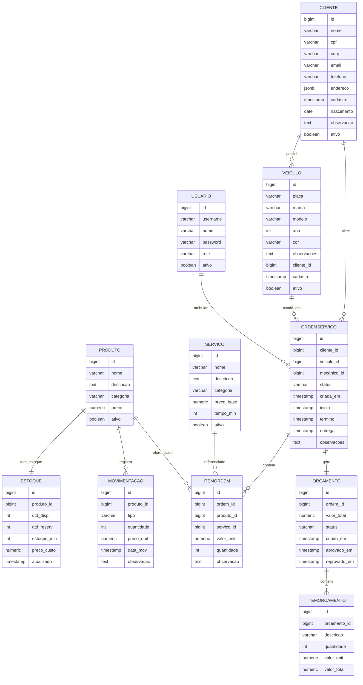
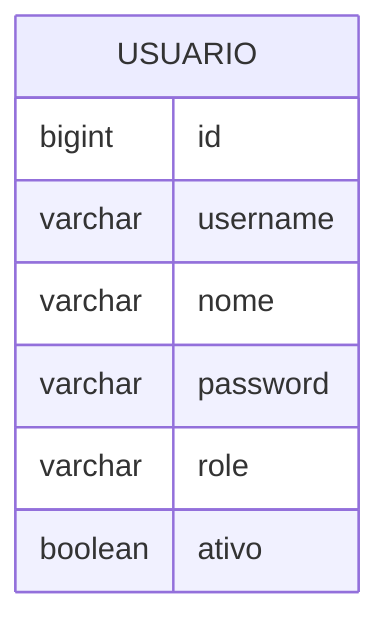
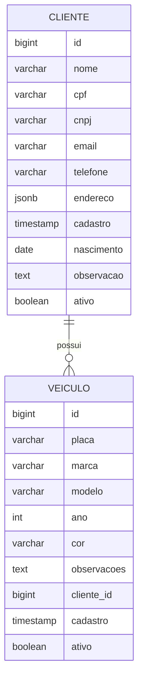
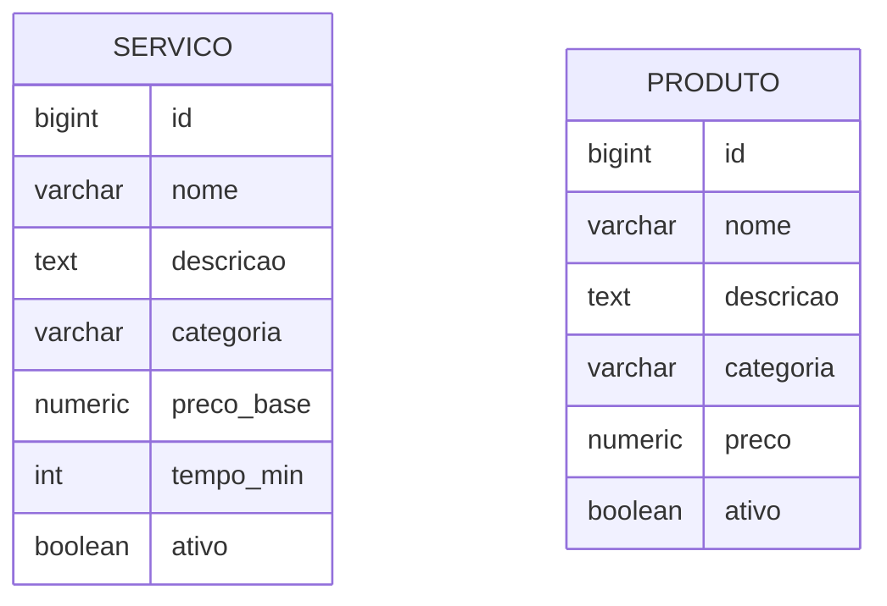
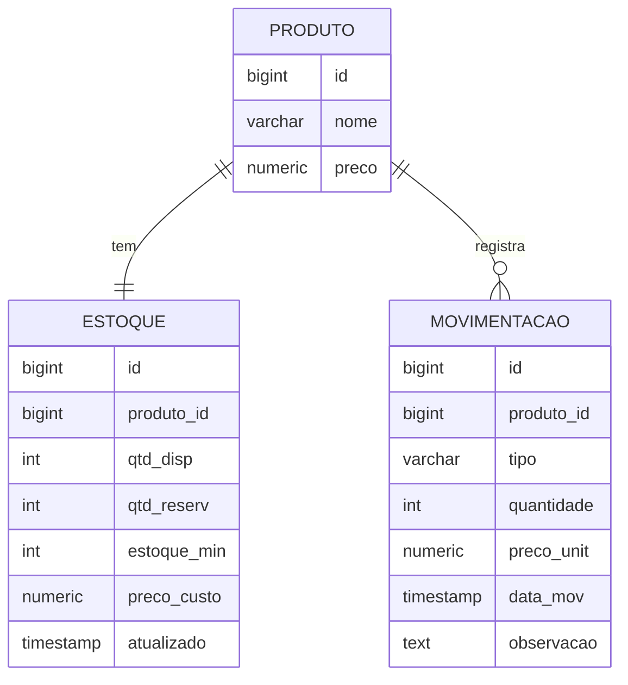
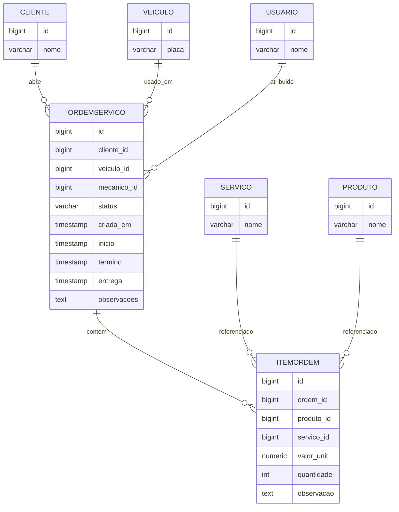
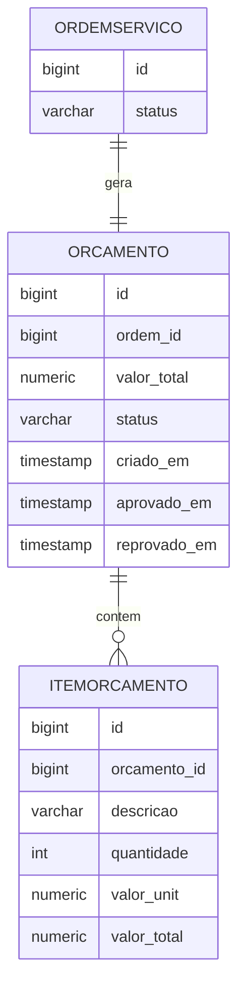
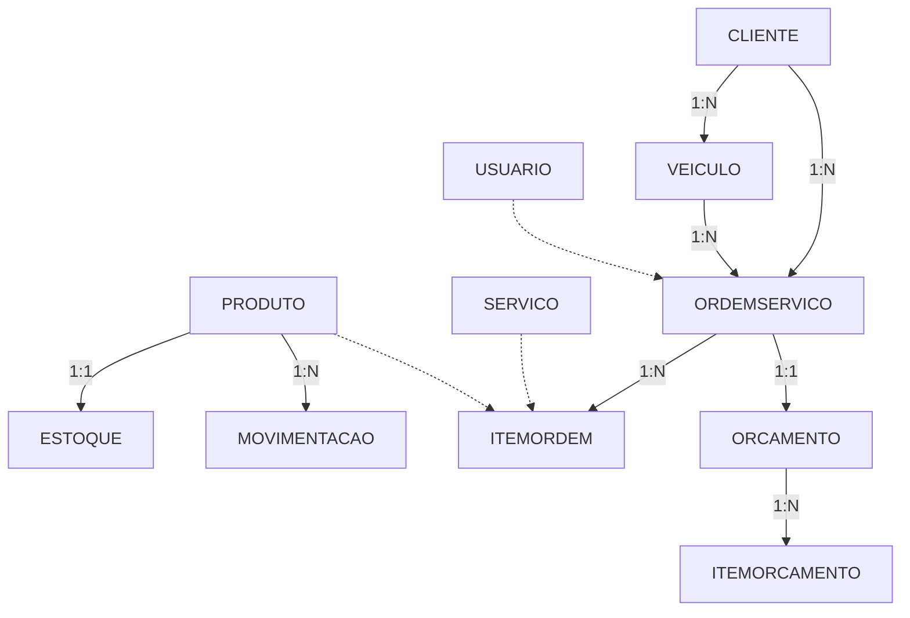

# Diagramas ER - Sistema de Oficina Mecânica

## 📋 Índice

- [Diagrama Completo](#diagrama-completo)
- [Diagrama por Microserviço](#diagrama-por-microserviço)
- [Diagrama Simplificado](#diagrama-simplificado)
- [Legenda e Convenções](#legenda-e-convenções)

> **Nota:** Os nomes das tabelas nos diagramas foram simplificados para compatibilidade com o renderizador Mermaid do GitHub. Veja a [tabela de mapeamento](#mapeamento-de-nomes) para os nomes reais no banco de dados.

---

## 🗂️ Diagrama Completo

Este diagrama mostra **todas as 11 tabelas** com seus atributos principais e relacionamentos.



---

## 🔤 Mapeamento de Nomes

### Tabelas

| Diagrama | Banco de Dados | Microserviço |
|----------|---------------|--------------|
| `USUARIO` | `usuarios` | auth-service |
| `CLIENTE` | `clientes` | customer-service |
| `VEICULO` | `veiculos` | customer-service |
| `SERVICO` | `servicos` | catalog-service |
| `PRODUTO` | `produtos_catalogo` | catalog-service |
| `ESTOQUE` | `produtos_estoque` | inventory-service |
| `MOVIMENTACAO` | `movimentacoes_estoque` | inventory-service |
| `ORDEMSERVICO` | `ordens_servico` | work-order-service |
| `ITEMORDEM` | `itens_ordem_servico` | work-order-service |
| `ORCAMENTO` | `orcamentos` | budget-service |
| `ITEMORCAMENTO` | `itens_orcamento` | budget-service |

### Colunas Abreviadas

| Diagrama | Banco de Dados |
|----------|---------------|
| `qtd_disp` | `quantidade_disponivel` |
| `qtd_reserv` | `quantidade_reservada` |
| `estoque_min` | `estoque_minimo` |
| `preco_unit` | `preco_unitario` |
| `data_mov` | `data_movimentacao` |
| `valor_unit` | `valor_unitario` |
| `tempo_min` | `tempo_estimado_minutos` |

---

## 🏢 Diagrama por Microserviço

### Auth Service



**Tabela real:** `usuarios`

**Roles:** ADMIN, CLIENTE, MECANICO, ATENDENTE, ESTOQUISTA

---

### Customer Service



**Tabelas reais:** `clientes`, `veiculos`

**Constraints:**
- Cliente: CPF OU CNPJ (exclusivo)
- Placa: Mercosul ou formato antigo
- Ano: 1900 até atual+1

---

### Catalog Service



**Tabelas reais:** `servicos`, `produtos_catalogo`

**Categorias Serviço:** MECANICO, ELETRICO, FREIOS, ALINHAMENTO, SUSPENSAO

**Categorias Produto:** PECA, INSUMO

---

### Inventory Service



**Tabelas reais:** `produtos_catalogo`, `produtos_estoque`, `movimentacoes_estoque`

**Tipos:** ENTRADA, SAIDA

---

### Work Order Service



**Tabelas reais:** `ordens_servico`, `itens_ordem_servico`

**Status:** RECEBIDA, EM_DIAGNOSTICO, AGUARDANDO_APROVACAO, EM_EXECUCAO, FINALIZADA, ENTREGUE, REPROVADA, CANCELADA

---

### Budget Service



**Tabelas reais:** `orcamentos`, `itens_orcamento`

**Status:** CRIADO, APROVADO, REPROVADO

---

## 🎨 Diagrama Simplificado



---

## 🔗 Relacionamentos Detalhados

### 1. CLIENTE → VEICULO (1:N)

```
CLIENTE (1) ──────── possui ──────── (N) VEICULO
```

**Descrição:** Um cliente pode possuir vários veículos, mas cada veículo pertence a apenas um cliente.

**Foreign Key:** `veiculos.cliente_id → clientes.id`

**ON DELETE:** `RESTRICT` - Não é possível deletar um cliente que possui veículos cadastrados.

**Exemplo:**
```sql
-- João da Silva possui 2 veículos
Cliente: João da Silva (id=1)
  ├─ Veículo: Honda Civic (placa ABC1D23)
  └─ Veículo: Toyota Corolla (placa XYZ9W87)
```

**Regra de Negócio:** Antes de deletar um cliente, é necessário transferir ou deletar todos os seus veículos.

---

### 2. CLIENTE → ORDEMSERVICO (1:N)

```
CLIENTE (1) ──────── abre ──────── (N) ORDEMSERVICO
```

**Descrição:** Um cliente pode abrir múltiplas ordens de serviço ao longo do tempo, mas cada ordem pertence a um único cliente.

**Foreign Key:** `ordens_servico.cliente_id → clientes.id`

**ON DELETE:** `RESTRICT` - Não é possível deletar um cliente que possui ordens de serviço.

**Exemplo:**
```sql
-- Maria Santos tem 3 OS
Cliente: Maria Santos (id=2)
  ├─ OS #001: Troca de óleo (FINALIZADA)
  ├─ OS #045: Revisão freios (EM_EXECUCAO)
  └─ OS #089: Alinhamento (RECEBIDA)
```

**Regra de Negócio:** Histórico de serviços é mantido para análise e relacionamento com o cliente.

---

### 3. VEICULO → ORDEMSERVICO (1:N)

```
VEICULO (1) ──────── usado_em ──────── (N) ORDEMSERVICO
```

**Descrição:** Um veículo pode ter várias ordens de serviço (histórico de manutenções), mas cada ordem é para um único veículo.

**Foreign Key:** `ordens_servico.veiculo_id → veiculos.id`

**ON DELETE:** `RESTRICT` - Não é possível deletar um veículo que possui histórico de OS.

**Exemplo:**
```sql
-- Honda Civic já teve 5 manutenções
Veículo: Honda Civic - ABC1D23 (id=1)
  ├─ OS #001: Troca de óleo - 10/01/2024
  ├─ OS #023: Revisão 10.000km - 15/03/2024
  ├─ OS #045: Troca de pastilhas - 20/05/2024
  ├─ OS #067: Alinhamento - 10/07/2024
  └─ OS #089: Revisão 20.000km - 01/09/2024
```

**Regra de Negócio:** Histórico completo de manutenções do veículo para rastreabilidade.

---

### 4. USUARIO → ORDEMSERVICO (0:N) - Opcional

```
USUARIO (0 ou 1) ──── atribuido ──── (N) ORDEMSERVICO
            mecânico
```

**Descrição:** Um mecânico pode ser atribuído a várias ordens de serviço, mas cada ordem pode ter apenas um mecânico responsável (ou nenhum).

**Foreign Key:** `ordens_servico.mecanico_id → usuarios.id`

**ON DELETE:** `SET NULL` - Se o mecânico sair da empresa, as OS continuam existindo mas sem mecânico atribuído.

**Cardinalidade Especial:** **Opcional** - A OS pode existir sem mecânico (status RECEBIDA, AGUARDANDO_APROVACAO).

**Exemplo:**
```sql
-- João Mecânico está trabalhando em 3 OS
Mecânico: João Silva (id=3)
  ├─ OS #045: Revisão freios (EM_EXECUCAO)
  ├─ OS #046: Troca de óleo (EM_EXECUCAO)
  └─ OS #047: Suspensão (EM_DIAGNOSTICO)

-- OS sem mecânico (ainda não atribuída)
OS #089: Alinhamento (RECEBIDA) - mecanico_id = NULL
```

**Regra de Negócio:** Mecânico é atribuído quando a OS muda para status EM_DIAGNOSTICO ou EM_EXECUCAO.

---

### 5. ORDEMSERVICO → ITEMORDEM (1:N)

```
ORDEMSERVICO (1) ──── contem ──── (N) ITEMORDEM
```

**Descrição:** Uma ordem de serviço contém vários itens (serviços e/ou produtos), mas cada item pertence a uma única OS.

**Foreign Key:** `itens_ordem_servico.ordem_servico_id → ordens_servico.id`

**ON DELETE:** `CASCADE` - Se a OS for deletada, todos os itens são deletados automaticamente.

**Exemplo:**
```sql
-- OS #045: Revisão completa
Ordem de Serviço #045 (id=45)
  ├─ Item 1: Serviço "Troca de óleo" - R$ 150,00
  ├─ Item 2: Produto "Óleo 5W30" (4L) - R$ 180,00
  ├─ Item 3: Produto "Filtro de óleo" - R$ 25,00
  ├─ Item 4: Serviço "Troca pastilhas" - R$ 180,00
  └─ Item 5: Produto "Pastilhas freio" - R$ 120,00
TOTAL: R$ 655,00
```

**Regra de Negócio:** Cada item é **OU** um serviço **OU** um produto (constraint `CHECK`).

---

### 6. SERVICO → ITEMORDEM (1:N) - Referência

```
SERVICO (1) ──── referenciado ──── (N) ITEMORDEM
```

**Descrição:** Um serviço do catálogo pode ser referenciado em várias ordens de serviço, mas cada item referencia apenas um serviço (ou nenhum, se for produto).

**Foreign Key:** `itens_ordem_servico.servico_id → servicos.id`

**ON DELETE:** `RESTRICT` - Não é possível deletar um serviço que já foi usado em alguma OS.

**Exemplo:**
```sql
-- Serviço "Troca de óleo" usado em várias OS
Serviço: Troca de óleo (id=1)
  ├─ Usado em OS #001 - Cliente: João
  ├─ Usado em OS #012 - Cliente: Maria
  ├─ Usado em OS #023 - Cliente: Pedro
  └─ Usado em OS #045 - Cliente: Ana
```

**Regra de Negócio:** Serviços não podem ser deletados, apenas marcados como `ativo = false`.

---

### 7. PRODUTO → ITEMORDEM (1:N) - Referência

```
PRODUTO (1) ──── referenciado ──── (N) ITEMORDEM
```

**Descrição:** Um produto do catálogo pode ser usado em várias ordens de serviço, mas cada item referencia apenas um produto (ou nenhum, se for serviço).

**Foreign Key:** `itens_ordem_servico.produto_catalogo_id → produtos_catalogo.id`

**ON DELETE:** `RESTRICT` - Não é possível deletar um produto que já foi usado.

**Exemplo:**
```sql
-- Produto "Óleo 5W30" usado em várias OS
Produto: Óleo Sintético 5W30 (id=1)
  ├─ Usado em OS #001 - 4L - R$ 180,00
  ├─ Usado em OS #012 - 4L - R$ 180,00
  ├─ Usado em OS #023 - 5L - R$ 225,00
  └─ Usado em OS #045 - 4L - R$ 180,00
```

**Regra de Negócio:** 
- Produtos não podem ser deletados se já foram usados
- Quantidade reservada no estoque ao criar item da OS
- Quantidade baixada do estoque ao finalizar OS

---

### 8. PRODUTO → ESTOQUE (1:1) - Exclusivo

```
PRODUTO (1) ════════ tem ════════ (1) ESTOQUE
```

**Descrição:** **Relacionamento 1:1 OBRIGATÓRIO** - Cada produto no catálogo tem **exatamente um** registro de controle de estoque.

**Foreign Key:** `produtos_estoque.produto_catalogo_id → produtos_catalogo.id` (UNIQUE)

**ON DELETE:** `CASCADE` - Se o produto for deletado, o estoque também é deletado.

**Exemplo:**
```sql
-- Produto sempre tem seu registro de estoque
Produto: Óleo 5W30 (id=1)
  └─ Estoque: 50 unidades disponíveis, 5 reservadas, mínimo 10

Produto: Filtro de Óleo (id=2)
  └─ Estoque: 20 unidades disponíveis, 0 reservadas, mínimo 5
```

**Regra de Negócio:** 
- Ao criar produto no catálogo, cria-se automaticamente o registro de estoque
- Não pode existir produto sem estoque nem estoque sem produto

---

### 9. PRODUTO → MOVIMENTACAO (1:N)

```
PRODUTO (1) ──── registra ──── (N) MOVIMENTACAO
```

**Descrição:** Um produto pode ter várias movimentações de estoque (entradas e saídas), mas cada movimentação refere-se a um único produto.

**Foreign Key:** `movimentacoes_estoque.produto_catalogo_id → produtos_catalogo.id`

**ON DELETE:** `RESTRICT` - Histórico de movimentações não pode ser perdido.

**Exemplo:**
```sql
-- Histórico do produto "Óleo 5W30"
Produto: Óleo 5W30 (id=1)
  ├─ 01/01: ENTRADA - 100 unidades - Compra fornecedor
  ├─ 05/01: SAIDA - 4 unidades - OS #001
  ├─ 10/01: SAIDA - 4 unidades - OS #012
  ├─ 15/01: ENTRADA - 50 unidades - Reposição
  └─ 20/01: SAIDA - 5 unidades - OS #023
```

**Regra de Negócio:** 
- **ENTRADA:** Compra de fornecedor, devolução de cliente
- **SAIDA:** Uso em OS, ajuste de inventário
- Histórico completo para auditoria e rastreabilidade

---

### 10. ORDEMSERVICO → ORCAMENTO (1:1) - Exclusivo

```
ORDEMSERVICO (1) ════════ gera ════════ (1) ORCAMENTO
```

**Descrição:** **Relacionamento 1:1 OBRIGATÓRIO** - Cada ordem de serviço tem **exatamente um** orçamento associado.

**Foreign Key:** `orcamentos.ordem_servico_id → ordens_servico.id` (UNIQUE)

**ON DELETE:** `CASCADE` - Se a OS for deletada, o orçamento também é deletado.

**Exemplo:**
```sql
-- OS sempre tem seu orçamento
Ordem de Serviço #045
  └─ Orçamento #045: R$ 655,00 - Status: APROVADO

Ordem de Serviço #089
  └─ Orçamento #089: R$ 350,00 - Status: CRIADO (aguardando)
```

**Regra de Negócio:** 
- Orçamento é criado automaticamente ao finalizar diagnóstico
- Cliente aprova ou reprova o orçamento
- Execução só inicia após aprovação

---

### 11. ORCAMENTO → ITEMORCAMENTO (1:N)

```
ORCAMENTO (1) ──── contem ──── (N) ITEMORCAMENTO
```

**Descrição:** Um orçamento contém vários itens detalhados (linha a linha), mas cada item pertence a um único orçamento.

**Foreign Key:** `itens_orcamento.orcamento_id → orcamentos.id`

**ON DELETE:** `CASCADE` - Se o orçamento for deletado, todos os itens são deletados.

**Exemplo:**
```sql
-- Orçamento #045 detalhado
Orçamento #045 - Total: R$ 655,00
  ├─ Item 1: "Troca de óleo + filtro" - 1x R$ 175,00 = R$ 175,00
  ├─ Item 2: "Óleo sintético 5W30 4L" - 1x R$ 180,00 = R$ 180,00
  ├─ Item 3: "Troca pastilhas freio" - 1x R$ 180,00 = R$ 180,00
  └─ Item 4: "Pastilhas freio dianteira" - 1x R$ 120,00 = R$ 120,00
                                            TOTAL: R$ 655,00
```

**Regra de Negócio:** 
- Itens do orçamento são cópia dos itens da OS
- `valor_total` é computado: `quantidade × valor_unitario`
- Cliente vê orçamento detalhado antes de aprovar

---

## 📊 Resumo Visual dos Relacionamentos

| Relacionamento | Tipo | Cardinalidade | ON DELETE | Opcional? |
|----------------|------|---------------|-----------|-----------|
| CLIENTE → VEICULO | 1:N | Um cliente, N veículos | RESTRICT | Não |
| CLIENTE → ORDEMSERVICO | 1:N | Um cliente, N OS | RESTRICT | Não |
| VEICULO → ORDEMSERVICO | 1:N | Um veículo, N OS | RESTRICT | Não |
| USUARIO → ORDEMSERVICO | 0:N | Zero ou um mecânico, N OS | SET NULL | **Sim** |
| ORDEMSERVICO → ITEMORDEM | 1:N | Uma OS, N itens | CASCADE | Não |
| SERVICO → ITEMORDEM | 1:N | Um serviço, N itens | RESTRICT | Não |
| PRODUTO → ITEMORDEM | 1:N | Um produto, N itens | RESTRICT | Não |
| PRODUTO → ESTOQUE | **1:1** | Um produto, um estoque | CASCADE | Não |
| PRODUTO → MOVIMENTACAO | 1:N | Um produto, N movimentações | RESTRICT | Não |
| ORDEMSERVICO → ORCAMENTO | **1:1** | Uma OS, um orçamento | CASCADE | Não |
| ORCAMENTO → ITEMORCAMENTO | 1:N | Um orçamento, N itens | CASCADE | Não |

---

## 📖 Legenda

### Cardinalidades

- `||--o{` = Um para muitos (obrigatório)
- `||--||` = Um para um (exclusivo)
- `o|--o{` = Zero ou um para muitos (opcional)

### ON DELETE

| Ação | Comportamento | Exemplo |
|------|--------------|---------|
| **RESTRICT** | Impede deleção se existirem dependentes | Cliente com veículos não pode ser deletado |
| **CASCADE** | Deleta automaticamente os dependentes | Deletar OS deleta seus itens |
| **SET NULL** | Define FK como NULL | Deletar mecânico mantém a OS |

---

## 📊 Foreign Keys

| Tabela | FK | Destino | ON DELETE |
|--------|-----|---------|-----------|
| veiculos | cliente_id | clientes | RESTRICT |
| ordens_servico | cliente_id | clientes | RESTRICT |
| ordens_servico | veiculo_id | veiculos | RESTRICT |
| ordens_servico | mecanico_id | usuarios | SET NULL |
| itens_ordem_servico | ordem_servico_id | ordens_servico | CASCADE |
| produtos_estoque | produto_catalogo_id | produtos_catalogo | CASCADE |
| movimentacoes_estoque | produto_catalogo_id | produtos_catalogo | RESTRICT |
| orcamentos | ordem_servico_id | ordens_servico | CASCADE |
| itens_orcamento | orcamento_id | orcamentos | CASCADE |

---

## 📊 Estatísticas

- **Tabelas:** 11
- **Foreign Keys:** 11
- **Unique Constraints:** 8
- **Check Constraints:** 15
- **Índices:** 25+
- **Relacionamentos 1:1:** 2
- **Relacionamentos 1:N:** 9

---

## 🔍 Queries de Exemplo

### Listar OS de um cliente

```sql
SELECT 
    os.id,
    os.status,
    c.nome AS cliente,
    v.placa,
    u.nome AS mecanico
FROM ordens_servico os
JOIN clientes c ON c.id = os.cliente_id
JOIN veiculos v ON v.id = os.veiculo_id
LEFT JOIN usuarios u ON u.id = os.mecanico_id
WHERE c.id = 1
ORDER BY os.criada_em DESC;
```

### Estoque baixo

```sql
SELECT 
    pc.nome,
    pe.quantidade_disponivel,
    pe.estoque_minimo
FROM produtos_estoque pe
JOIN produtos_catalogo pc ON pc.id = pe.produto_catalogo_id
WHERE pe.quantidade_disponivel < pe.estoque_minimo;
```

### Total de OS

```sql
SELECT 
    os.id,
    SUM(ios.valor_unitario * ios.quantidade) AS total
FROM ordens_servico os
JOIN itens_ordem_servico ios ON ios.ordem_servico_id = os.id
WHERE os.id = 1
GROUP BY os.id;
```

---

## 📚 Referências

- [Mermaid ER Syntax](https://mermaid.js.org/syntax/entityRelationshipDiagram.html)
- [PostgreSQL Constraints](https://www.postgresql.org/docs/current/ddl-constraints.html)
- [GitHub Mermaid](https://docs.github.com/en/get-started/writing-on-github/working-with-advanced-formatting/creating-diagrams)

---

## 📝 Histórico

| Versão | Data | Descrição |
|--------|------|-----------|
| 1.0.0 | 2024-12-30 | Versão inicial |
| 1.1.0 | 2024-12-30 | Correção formatação GitHub |

---

**Repositório:** [infra-database](https://github.com/seu-usuario/infra-database)  
**Status:** ✅ Aprovado
