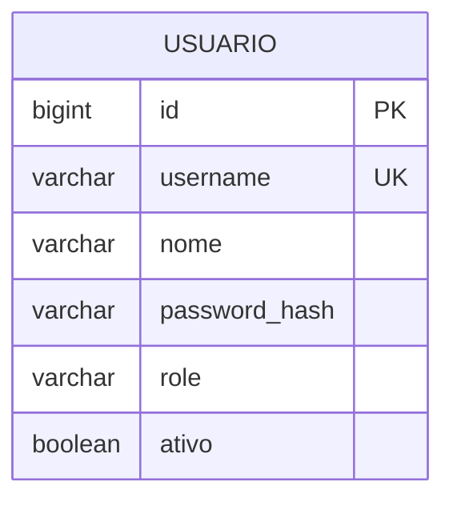
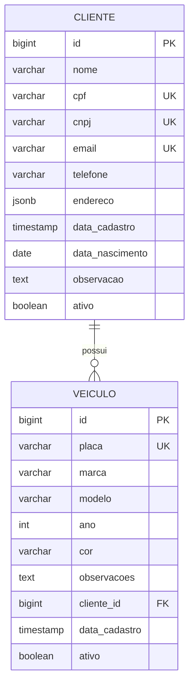
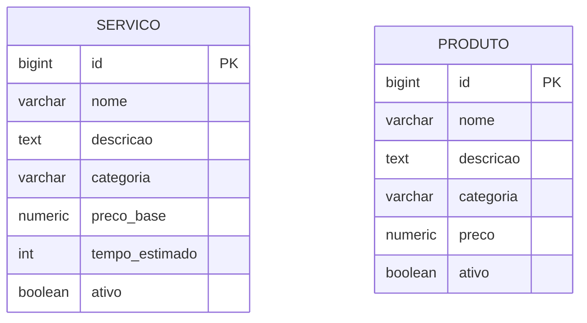
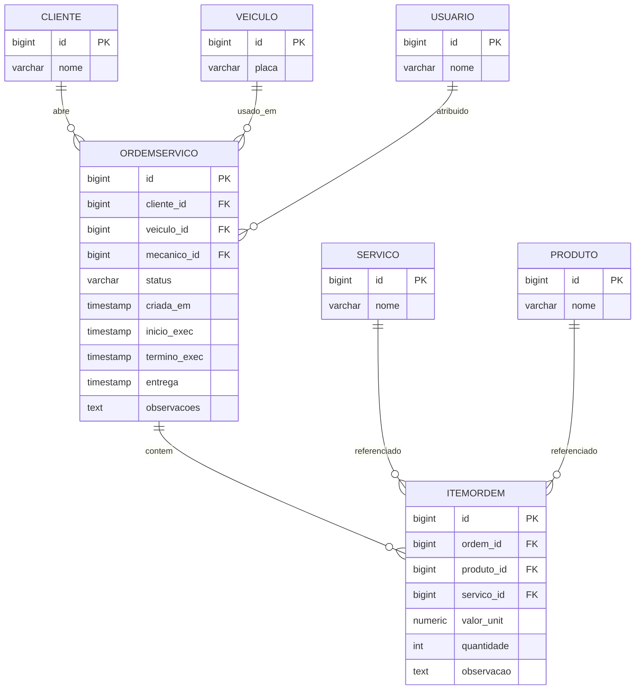
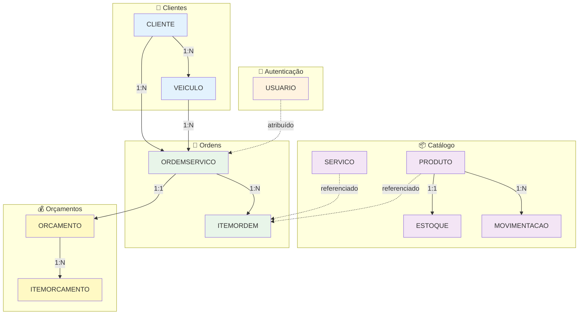

# Diagramas ER - Sistema de Oficina Mecânica

## 📋 Índice

- [Diagrama Completo](#diagrama-completo)
- [Diagrama por Microserviço](#diagrama-por-microserviço)
- [Diagrama Simplificado](#diagrama-simplificado)
- [Legenda e Convenções](#legenda-e-convenções)

> **Nota:** Os nomes das tabelas nos diagramas foram simplificados para compatibilidade com o renderizador Mermaid do GitHub. Veja a [tabela de mapeamento](#mapeamento-de-nomes) para os nomes reais no banco de dados.

---

## 🗂️ Diagrama Completo

Este diagrama mostra **todas as 11 tabelas** com seus atributos principais e relacionamentos.

```mermaid
erDiagram
    USUARIO {
        bigint id PK
        varchar username UK
        varchar nome
        varchar password_hash
        varchar role
        boolean ativo
    }

    CLIENTE {
        bigint id PK
        varchar nome
        varchar cpf UK
        varchar cnpj UK
        varchar email UK
        varchar telefone
        jsonb endereco
        timestamp data_cadastro
        date data_nascimento
        text observacao
        boolean ativo
    }

    VEICULO {
        bigint id PK
        varchar placa UK
        varchar marca
        varchar modelo
        int ano
        varchar cor
        text observacoes
        bigint cliente_id FK
        timestamp data_cadastro
        boolean ativo
    }

    SERVICO {
        bigint id PK
        varchar nome
        text descricao
        varchar categoria
        numeric preco_base
        int tempo_estimado
        boolean ativo
    }

    PRODUTO {
        bigint id PK
        varchar nome
        text descricao
        varchar categoria
        numeric preco
        boolean ativo
    }

    ESTOQUE {
        bigint id PK
        bigint produto_id FK_UK
        int qtd_disponivel
        int qtd_reservada
        int estoque_minimo
        numeric preco_custo
        timestamp atualizado_em
    }

    MOVIMENTACAO {
        bigint id PK
        bigint produto_id FK
        varchar tipo
        int quantidade
        numeric preco_unit
        timestamp data_mov
        text observacao
    }

    ORDEMSERVICO {
        bigint id PK
        bigint cliente_id FK
        bigint veiculo_id FK
        bigint mecanico_id FK
        varchar status
        timestamp criada_em
        timestamp inicio_exec
        timestamp termino_exec
        timestamp entrega
        text observacoes
    }

    ITEMORDEM {
        bigint id PK
        bigint ordem_id FK
        bigint produto_id FK
        bigint servico_id FK
        numeric valor_unit
        int quantidade
        text observacao
    }

    ORCAMENTO {
        bigint id PK
        bigint ordem_id FK_UK
        numeric valor_total
        varchar status
        timestamp criado_em
        timestamp aprovado_em
        timestamp reprovado_em
    }

    ITEMORCAMENTO {
        bigint id PK
        bigint orcamento_id FK
        varchar descricao
        int quantidade
        numeric valor_unit
        numeric valor_total
    }

    CLIENTE ||--o{ VEICULO : possui
    CLIENTE ||--o{ ORDEMSERVICO : abre
    VEICULO ||--o{ ORDEMSERVICO : usado_em
    USUARIO ||--o{ ORDEMSERVICO : atribuido
    ORDEMSERVICO ||--o{ ITEMORDEM : contem
    ORDEMSERVICO ||--|| ORCAMENTO : gera
    ORCAMENTO ||--o{ ITEMORCAMENTO : contem
    SERVICO ||--o{ ITEMORDEM : referenciado
    PRODUTO ||--|| ESTOQUE : tem_estoque
    PRODUTO ||--o{ ITEMORDEM : referenciado
    PRODUTO ||--o{ MOVIMENTACAO : registra
```

---

## 🔤 Mapeamento de Nomes

| Diagrama (simplificado) | Banco de Dados (real) | Microserviço |
|-------------------------|----------------------|--------------|
| `USUARIO` | `usuarios` | auth-service |
| `CLIENTE` | `clientes` | customer-service |
| `VEICULO` | `veiculos` | customer-service |
| `SERVICO` | `servicos` | catalog-service |
| `PRODUTO` | `produtos_catalogo` | catalog-service |
| `ESTOQUE` | `produtos_estoque` | inventory-service |
| `MOVIMENTACAO` | `movimentacoes_estoque` | inventory-service |
| `ORDEMSERVICO` | `ordens_servico` | work-order-service |
| `ITEMORDEM` | `itens_ordem_servico` | work-order-service |
| `ORCAMENTO` | `orcamentos` | budget-service |
| `ITEMORCAMENTO` | `itens_orcamento` | budget-service |

---

## 🏢 Diagrama por Microserviço

### Auth Service



**Tabela real:** `usuarios`

**Roles disponíveis:** ADMIN, CLIENTE, MECANICO, ATENDENTE, ESTOQUISTA

---

### Customer Service



**Tabelas reais:** `clientes`, `veiculos`

**Constraints:**
- Cliente: CPF **OU** CNPJ (não ambos)
- Placa: Formato Mercosul (ABC1D23) ou antigo (ABC1234)

---

### Catalog Service



**Tabelas reais:** `servicos`, `produtos_catalogo`

**Categorias de Serviço:** MECANICO, ELETRICO, FREIOS, ALINHAMENTO, SUSPENSAO

**Categorias de Produto:** PECA, INSUMO

---

### Inventory Service

```mermaid
erDiagram
    PRODUTO {
        bigint id PK
        varchar nome
        numeric preco
    }

    ESTOQUE {
        bigint id PK
        bigint produto_id FK_UK
        int qtd_disponivel
        int qtd_reservada
        int estoque_minimo
        numeric preco_custo
        timestamp atualizado_em
    }

    MOVIMENTACAO {
        bigint id PK
        bigint produto_id FK
        varchar tipo
        int quantidade
        numeric preco_unit
        timestamp data_mov
        text observacao
    }

    PRODUTO ||--|| ESTOQUE : tem
    PRODUTO ||--o{ MOVIMENTACAO : registra
```

**Tabelas reais:** `produtos_catalogo`, `produtos_estoque`, `movimentacoes_estoque`

**Relacionamento 1:1:** Cada produto tem exatamente um registro de estoque

**Tipos de Movimentação:** ENTRADA, SAIDA

---

### Work Order Service



**Tabelas reais:** `ordens_servico`, `itens_ordem_servico`

**Status:** RECEBIDA, EM_DIAGNOSTICO, AGUARDANDO_APROVACAO, EM_EXECUCAO, FINALIZADA, ENTREGUE, REPROVADA, CANCELADA

**Constraint:** Cada item é **OU** produto **OU** serviço (não ambos)

---

### Budget Service

```mermaid
erDiagram
    ORDEMSERVICO {
        bigint id PK
        varchar status
    }

    ORCAMENTO {
        bigint id PK
        bigint ordem_id FK_UK
        numeric valor_total
        varchar status
        timestamp criado_em
        timestamp aprovado_em
        timestamp reprovado_em
    }

    ITEMORCAMENTO {
        bigint id PK
        bigint orcamento_id FK
        varchar descricao
        int quantidade
        numeric valor_unit
        numeric valor_total
    }

    ORDEMSERVICO ||--|| ORCAMENTO : gera
    ORCAMENTO ||--o{ ITEMORCAMENTO : contem
```

**Tabelas reais:** `orcamentos`, `itens_orcamento`

**Relacionamento 1:1:** Cada OS tem exatamente um orçamento

**Status:** CRIADO, APROVADO, REPROVADO

**Computed Column:** `valor_total` = quantidade × valor_unitário

---

## 🎨 Diagrama Simplificado



---

## 📖 Legenda

### Símbolos

| Símbolo | Significado |
|---------|-------------|
| **PK** | Primary Key |
| **FK** | Foreign Key |
| **UK** | Unique Key |
| **FK_UK** | Foreign Key única (relação 1:1) |

### Cardinalidades

| Notação | Significado | Exemplo |
|---------|-------------|---------|
| `\|\|--o{` | Um para muitos | Cliente → Veículos |
| `\|\|--\|\|` | Um para um | Produto → Estoque |
| `o\|--o{` | Zero ou um para muitos | Mecânico → OS |

### Cores

| Cor | Contexto | Microserviço |
|-----|----------|-------------|
| 🔵 Azul | Clientes/Veículos | customer-service |
| 🟠 Laranja | Autenticação | auth-service |
| 🟣 Roxo | Catálogo/Estoque | catalog-service, inventory-service |
| 🟢 Verde | Ordens de Serviço | work-order-service |
| 🟡 Amarelo | Orçamentos | budget-service |

---

## 📊 Tabela de Foreign Keys

| Tabela | FK | Destino | ON DELETE | Motivo |
|--------|-----|---------|-----------|--------|
| veiculos | cliente_id | clientes | RESTRICT | Não deletar cliente com veículos |
| ordens_servico | cliente_id | clientes | RESTRICT | Não deletar cliente com OS |
| ordens_servico | veiculo_id | veiculos | RESTRICT | Não deletar veículo com OS |
| ordens_servico | mecanico_id | usuarios | SET NULL | Mecânico pode sair |
| itens_ordem_servico | ordem_servico_id | ordens_servico | CASCADE | Deletar itens com OS |
| itens_ordem_servico | produto_catalogo_id | produtos_catalogo | RESTRICT | Não deletar produto em uso |
| itens_ordem_servico | servico_id | servicos | RESTRICT | Não deletar serviço em uso |
| produtos_estoque | produto_catalogo_id | produtos_catalogo | CASCADE | Estoque segue produto |
| movimentacoes_estoque | produto_catalogo_id | produtos_catalogo | RESTRICT | Preservar histórico |
| orcamentos | ordem_servico_id | ordens_servico | CASCADE | Orçamento é parte da OS |
| itens_orcamento | orcamento_id | orcamentos | CASCADE | Itens seguem orçamento |

---

## 📊 Estatísticas

| Métrica | Quantidade |
|---------|-----------|
| **Tabelas** | 11 |
| **Colunas** | ~80 |
| **Foreign Keys** | 11 |
| **Unique Constraints** | 8 |
| **Check Constraints** | 15 |
| **Índices** | 25+ |
| **Relacionamentos 1:1** | 2 |
| **Relacionamentos 1:N** | 9 |

---

## 🔍 Queries de Exemplo

### Listar OS de um cliente

```sql
SELECT 
    os.id,
    os.status,
    c.nome AS cliente,
    v.placa,
    u.nome AS mecanico
FROM ordens_servico os
JOIN clientes c ON c.id = os.cliente_id
JOIN veiculos v ON v.id = os.veiculo_id
LEFT JOIN usuarios u ON u.id = os.mecanico_id
WHERE c.id = 1
ORDER BY os.criada_em DESC;
```

### Produtos com estoque baixo

```sql
SELECT 
    pc.nome,
    pe.quantidade_disponivel,
    pe.estoque_minimo,
    (pe.estoque_minimo - pe.quantidade_disponivel) AS deficit
FROM produtos_estoque pe
JOIN produtos_catalogo pc ON pc.id = pe.produto_catalogo_id
WHERE pe.quantidade_disponivel < pe.estoque_minimo
ORDER BY deficit DESC;
```

### Total de uma OS

```sql
SELECT 
    os.id,
    SUM(ios.valor_unitario * ios.quantidade) AS total
FROM ordens_servico os
JOIN itens_ordem_servico ios ON ios.ordem_servico_id = os.id
WHERE os.id = 1
GROUP BY os.id;
```

---

## 📚 Referências

- [Mermaid ER Syntax](https://mermaid.js.org/syntax/entityRelationshipDiagram.html)
- [PostgreSQL Foreign Keys](https://www.postgresql.org/docs/current/ddl-constraints.html#DDL-CONSTRAINTS-FK)
- [GitHub Mermaid Support](https://docs.github.com/en/get-started/writing-on-github/working-with-advanced-formatting/creating-diagrams)

---

## 📝 Histórico

| Versão | Data | Descrição |
|--------|------|-----------|
| 1.0.0 | 2024-12-30 | Versão inicial |
| 1.0.1 | 2024-12-30 | Correção para GitHub (nomes curtos) |

---

**Repositório:** [infra-database](https://github.com/seu-usuario/infra-database)  
**Autor:** Equipe Tech Challenge FIAP  
**Status:** ✅ Aprovado
